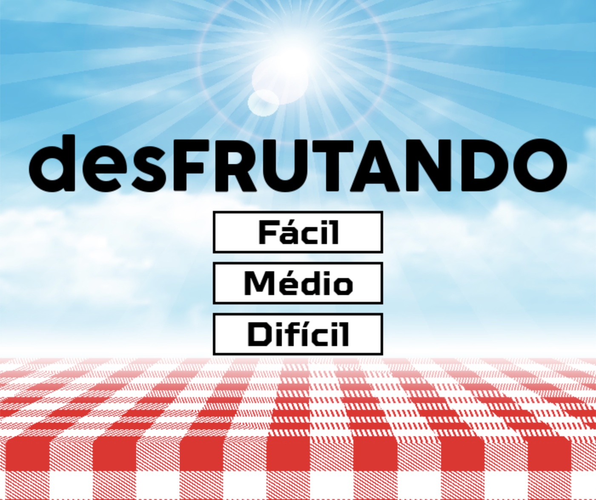

# desFRUTANDO 🍉🍑🫐




## 📹 VÍDEO DE DEMONSTRAÇÃO DO JOGO

[Assista ao vídeo de como jogar (Youtube)](https://youtu.be/i1GylANJXa4)


## 🎮 Sobre o Projeto

"*desFRUTANDO*"  é um jogo estilo Fruit Ninja desenvolvido em Python com Pygame, onde o jogador usa uma faca controlada pelo mouse para cortar frutas e evitar bombas. Conforme o tempo e pontuação aumentam, o jogo se torna mais desafiador, com novos elementos, efeitos especiais, sons e modos de dificuldade.


## 🧠 Como Jogar

- 🖥️ **Execute o jogo:**  
  Para abrir o jogo, após o download de todos os requisitos, de inicio no arquivo `main.py`

- **Escolha o modo de jogo:**  
    Na tela inicial, clique em "Fácil", "Médio" ou "Difícil".

        - 🍉 *Fácil*: a fruta é uma melancia, seu tamanho facilita acertá-la.
        - 🍑 *Médio*: a fruta é um pêssego, com um tamanho intermediário.
        - 🫐 *Difícil*: a fruta é um mirtilo, por ser a menor dificulta acertá-la. 


- 🖱️ **Objetivo:**  
    Use o *mouse* para movimentar a faca e segure o botão *esquerdo* para cortar as frutas.

    Corte frutas para ganhar pontos.

    *Evite as bombas*! Se cortar uma, o jogo acaba.

    O jogo acelera e as frutas saem de outras direções conforme você acumula mais pontos. 
    
    *Prepare-se para o caos!*


- ❤️ **Vidas:**  
  Você começa com 3 vidas.  
  Perde uma vida se deixar uma fruta normal cair.


- **Elementos especiais:**  
  - ⚜️ **Dourada:** Pontos em dobro por 10 segundos.
  - 🧊 **Gelo:** Deixa o jogo mais lento por 5 segundos.


- 🎮 **Game Over:**  
  Quando perder todas as vidas ou cortar uma bomba, aparece a tela de "Game Over".

  Clique em "Jogar Novamente" para recomeçar.


## 💻 Requisitos de instalação

- Python 3.x  
- Pygame
- os
- random


Instale o "pygame" com:
```sh
pip install pygame
```

## 👥 Créditos

- Luana Hughes Freitas
- Gabriela Ferrão Baroni
- Laura Vendramini Paulovich Pittoli 

---
## 🍴 Divirta-se jogando!


